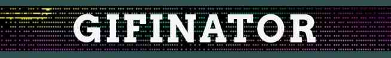

Simple page to fetch GIFS of your choice from GIPHY library

## Getting started

- run `composer install` to get necessary dependencies
- rename `.env.example` to `.env`
- get your API key from https://developers.giphy.com/ and paste it in `.env`
- run `php -S localhost:8000` to start server
- click on site that appears in terminal to open it in browser
- have fun!